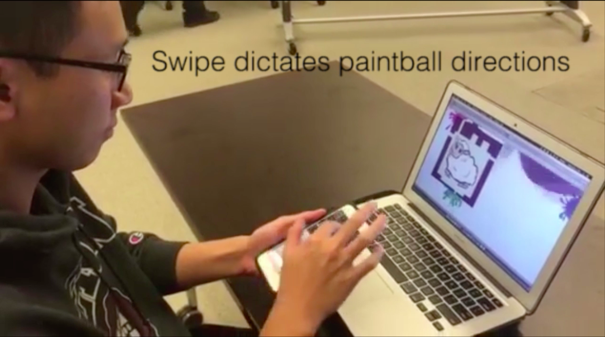

# Augmented Reality Paintball 

# Overview

In this project, I was able to develop a simple augmented reality application in Unity using Photon and Vuforia. 

The goal is to use your phone to shoot paintballs at your computer. The paintball's speed and direction are dictated by how fast the user swipes and where the user swipes. 

# Demo
 

# How to Run on iOS
- Build mobile scene for iOS in Unity.
- Open the newly created Xcode project.
- Build for your iPhone in Xcode (make sure your phone is plugged in).
    - You may have to set up for a developer's account and set up dependencies 
    - [https://livecode.com/how-to-create-a-free-ios-development-provisioning-profile/]

# References
- [Apple Provisioning Profile](https://livecode.com/how-to-create-a-free-ios-development-provisioning-profile/)
- [Running Unity on iOS](https://unity3d.com/learn/tutorials/topics/mobile-touch/building-your-unity-game-ios-device-testing)
- [Swipe Detection](http://blog.trsquarelab.com/2015/02/detecting-swipe-from-unity3d-c-scripts.html)
- [Photon Intro](https://doc.photonengine.com/en-us/pun/current/getting-started/pun-intro)